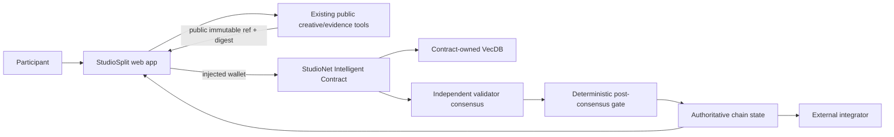
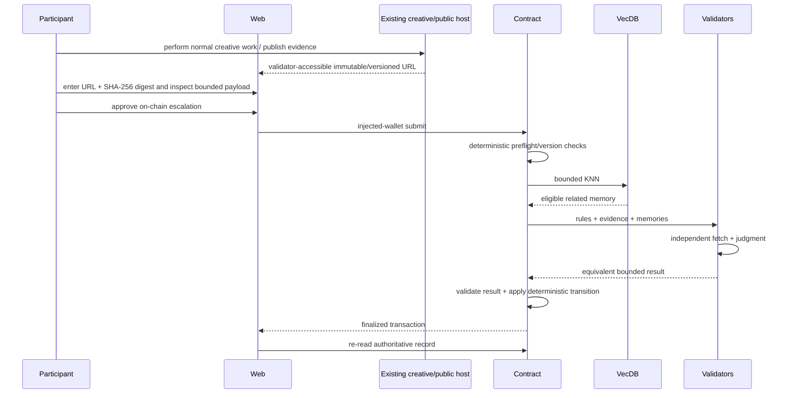

# StudioSplit — Architecture

## 1. Architectural thesis

StudioSplit converts months of messy off-chain creative collaboration into one auditable, rubric-bound ownership split. Collaborators checkpoint contribution claims against immutable artifact versions. At finalization, VecDB surfaces overlapping claims and related checkpoints. Validators assign fixed contribution bands by dimension; deterministic code normalizes the agreed bands into exactly 10,000 basis points. The model never directly chooses percentages.

The architecture preserves one boundary:

> High-volume creation/observation happens off-chain; **a project-version-bound contributor ownership/credit split expressed as exactly 10,000 basis points** becomes authoritative only after a bounded GenLayer flow.

## 2. System context



There is no StudioSplit backend or database. Browser state is convenience only; contract reads are authoritative.

## 3. Components

### Web application

- domain workflow;
- public browsing;
- injected wallet;
- artifact preparation;
- live contract reads;
- transaction/finality rail;
- semantic-memory display;
- authoritative decision/history pages.

### Browser/off-chain preparation

StudioSplit has no backend or persistent database. Existing creative tools remain the work plane. The browser prepares bounded public evidence references, digests and transaction inputs, and may keep only ephemeral/local UI state.

### Intelligent Contract

Project rubric; collaborator registry; checkpoint digests; bounded contribution claims; semantic overlap index; finalization case; agreed contribution bands; deterministic bps split; immutable split receipt.

### Contract-owned semantic memory

Embed each checkpoint claim from role, artifact version, contribution dimension, bounded description and referenced artifact digest. During finalization, retrieve overlaps for each contributor/dimension pair to highlight duplicate/overlapping claims and longitudinal contribution patterns.

## 4. Data ownership

| Data | Source of truth | Mutable | Consensus input |
|---|---|---:|---:|
| Draft/high-volume work | Existing creative tools (outside StudioSplit) | Yes | No, until a public ref + digest is submitted |
| Frozen public artifact | Artifact store + chain digest | No | Yes |
| Rules/charter/rubric version | Contract | Versioned | Yes |
| VecDB pointer/vector | Contract | Append by invariant | Yes, bounded retrieval |
| Final status/receipt | Contract | Terminal/versioned | N/A; output |
| UI state/cache | Browser only | Yes | Never authoritative |
| Deployment facts | Repository docs + explorer/chain | Append | N/A |

## 5. Domain contract model

- Project { creator, name, charter_url, charter_digest, rubric_json, status, collaborator_count, checkpoint_count, version }
- Collaborator { project_id, wallet, role_label, active }
- Checkpoint { project_id, contributor, artifact_url, artifact_digest, dimension_code, contribution_text, submitted_at }
- Finalization { project_id, release_url, release_digest, status, band_matrix_json, overlap_refs_json, rationale, requested_at, resolved_at }
- SplitEntry { project_id, contributor, bps, score_units }
- VectorPointer { checkpoint_id, project_id, contributor }

## 6. Public contract surface

- create_project(name, charter_url, charter_digest, rubric_json) -> project_id
- add_collaborator(project_id, wallet, role_label)
- submit_checkpoint(project_id, artifact_url, artifact_digest, dimension_code, contribution_text) -> checkpoint_id
- request_finalization(project_id, release_artifact_url, release_digest) -> finalization_id
- adjudicate_finalization(finalization_id) -> band matrix + split
- cancel_finalization(finalization_id)
- get_project_count()
- get_project(project_id)
- list_projects(start, limit)
- list_collaborators(project_id)
- get_checkpoint(checkpoint_id)
- list_checkpoints(project_id, start, limit)
- get_finalization(finalization_id)
- get_split(project_id)
- preview_overlaps(project_id, collaborator, dimension, k)

Third-party consumers must be able to reconstruct the final status from views alone.

## 7. End-to-end sequence



## 8. Semantic-memory path

Embedding inputs:

Embed each checkpoint claim from role, artifact version, contribution dimension, bounded description and referenced artifact digest. During finalization, retrieve overlaps for each contributor/dimension pair to highlight duplicate/overlapping claims and longitudinal contribution patterns.

Decision prompt fields:

- project charter/rubric
- release artifact digest
- collaborator list
- checkpoint claims grouped by dimension
- public artifact excerpts/previews
- retrieved overlaps/dependencies

The architecture deliberately separates **selection** from **judgment**. A memory hit is never enough to authorize the final transition.

## 9. Browser-only preparation boundary

StudioSplit exposes no API routes and owns no database or object store. A user supplies a public validator-accessible artifact URL and digest. The browser validates bounds/format, shows the exact payload, and submits through the injected wallet.

### Artifact freeze flow

```text
existing creative/public hosting tool
  -> user chooses intentional public evidence
  -> user supplies immutable/versioned URL
  -> browser validates URL + SHA-256 digest
  -> user sees exact digest + claim preview
  -> injected-wallet chain submission
```

If the referenced artifact changes, the submitted digest no longer matches and validators fail closed. StudioSplit never uploads or silently rewrites evidence.

## 10. Route architecture

| Route | Domain screen | Primary action |
| --- | --- | --- |
| / | Project tape | Open project |
| /projects/[id]/lanes | Collaborator lanes | Inspect lane |
| /projects/[id]/checkpoint | Checkpoint recorder | Record checkpoint |
| /projects/[id]/artifacts | Artifact version room | Select version |
| /projects/[id]/overlap | Overlap matrix | Inspect overlap |
| /projects/[id]/finalize | Final split desk | Request/run finalization |
| /projects/[id]/receipt | Credit receipt | Export credit sheet |

The full layout rules are in `ui/ux.md`.

## 11. State transition principles

Status vocabulary:

```text
OPEN, CHECKPOINTING, FINALIZATION_REQUESTED, UNDER_REVIEW, FINALIZED, ABSTAINED, CANCELLED
```

Implement an explicit transition table in code/tests. Do not infer allowed transitions from ordering above.

A final record is immutable. Corrections create an explicit version/supersession/new case.

## 12. Consensus boundary

Decision:

> For each collaborator and rubric dimension, validators choose a fixed band 0-5 based on public checkpoint evidence and retrieved overlaps: NONE, MINOR, SUPPORTING, MATERIAL, LEADING, DEFINING. They also flag DUPLICATIVE/DEPENDENT claims. Deterministic weights from the project rubric convert bands to scores and then normalize all contributors to exactly 10,000 bps.

### Before nondeterminism

- role/identity;
- record exists;
- state allows review;
- base version current;
- sizes/counts bounded;
- immutable evidence refs syntactically valid;
- required enumerations allowed.

### Inside nondeterminism

- independently fetch public evidence where needed;
- interpret semantic evidence;
- compare retrieved memories for applicability;
- return fixed enums/bands/IDs.

### After nondeterminism

- validate all returned IDs/enums;
- re-check base state;
- deterministic arithmetic/state changes;
- memory insertion;
- events/counters.

## 13. Security boundaries

### User/caller

Cannot make user-submitted prose authoritative external evidence by assertion.

### Public evidence

Potential prompt injection. Bound and frame as data. Unavailable evidence fails closed.

### Semantic memory

Public and fallible as precedent/context. Namespace/version filters are deterministic.

### Browser

Can prepare inputs and render reads; cannot bypass contract authorization or make local state authoritative.

### Wallet

Actual provider account/network immediately before signature is authoritative.

### Runtime

Finalized transaction status alone is not success; GenVM execution must be inspected.

## 14. Failure semantics

| Failure | Result |
|---|---|
| Evidence URL unavailable during consensus | explicit insufficient/failure; no positive state |
| No eligible VecDB memories | proceed only if domain rules permit; show “no related memory” |
| Validator disagreement | no unauthorized final state |
| Stale base version | reject before consensus |
| FINALIZED + rollback | show failure, re-read state |
| Malformed live read | unavailable, not empty/default |

## 15. Scaling model

The product scales because the repeated/high-volume work is outside consensus.

- Paginate chain lists.
- Keep stored strings bounded.
- Use small vector pointers.
- Use deterministic domain filters around KNN.
- Keep validator context small.
- Split oversized cases/releases rather than raising every bound.
- Benchmark actual runtime before claiming large VecDB scale.

## 16. Observability

Log without secrets:

- artifact digest;
- record/case IDs;
- tx hashes;
- wallet chain changes;
- finality state;
- GenVM result;
- source fetch failure category;
- selected memory IDs;
- contract status after re-read.

## 17. Project invariants

- Only registered collaborators may checkpoint for themselves.
- Rubric weights freeze when first checkpoint is submitted.
- Final percentages are deterministic normalization of agreed integer bands.
- Split sum must equal exactly 10,000 bps.
- Finalized project cannot accept new checkpoints without explicit new version/reopen workflow.
- Artifact digest is required for every checkpoint.

## 18. Concrete test scenario

Four-person music/video project with dimensions writing, arrangement, production, visual edit, project direction. Two people claim the same chorus arrangement checkpoint; one is original and the other dependent refinement.

## 19. Reference end-to-end demo

Create a song/video project with four collaborators, add checkpoints across writing/editing/design/production, intentionally overlap two claims, request finalization, inspect semantic overlap, reach band matrix, normalize to 10,000 bps and export a signed credit sheet.
